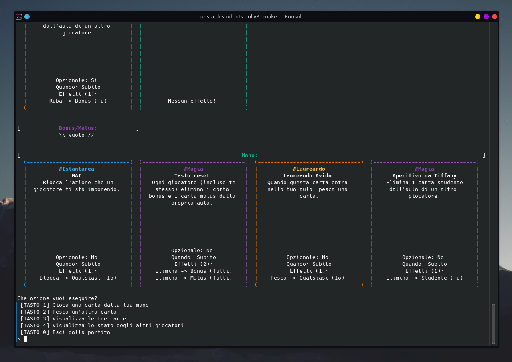
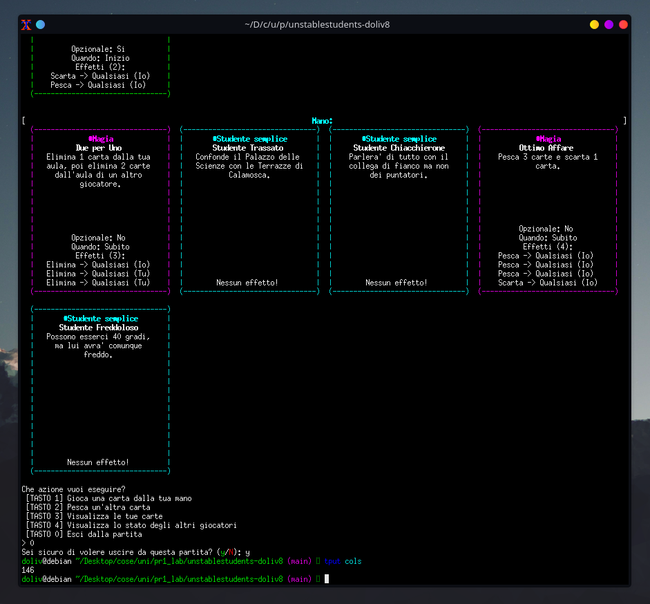
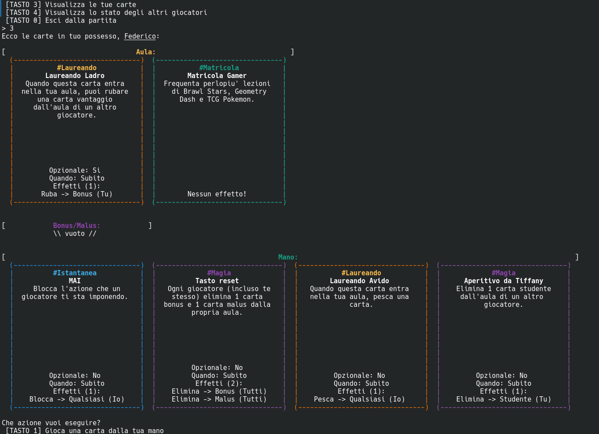
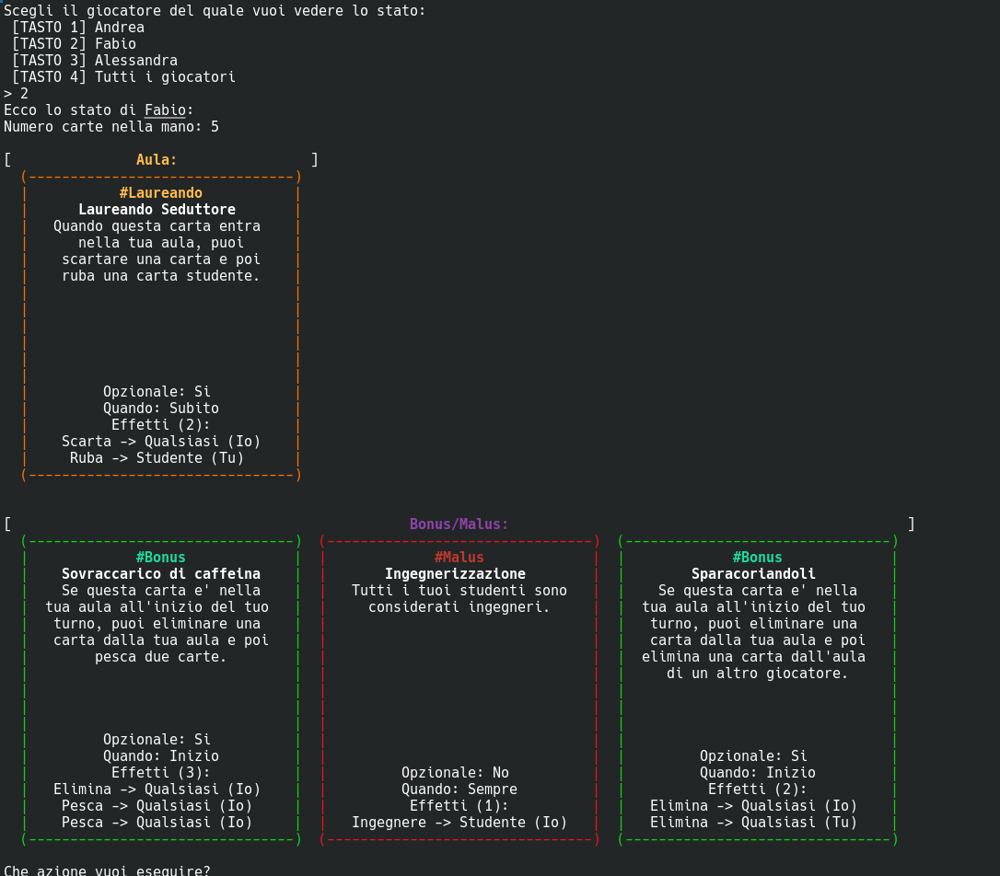
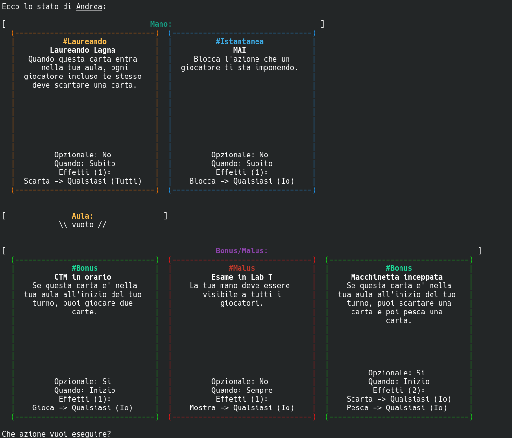
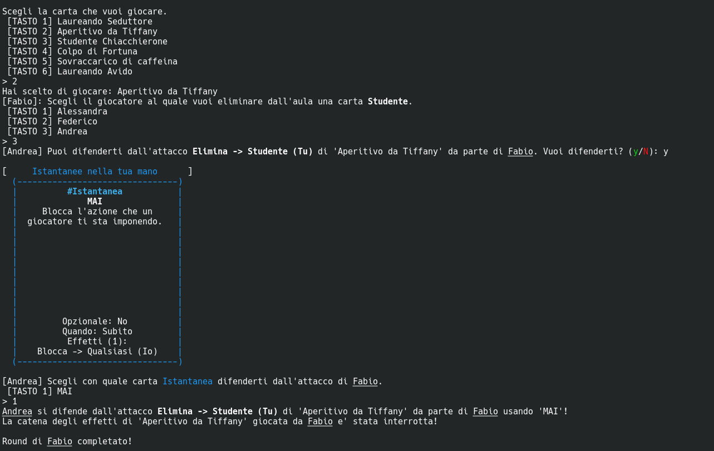
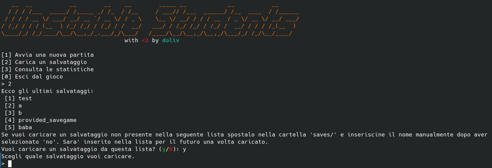
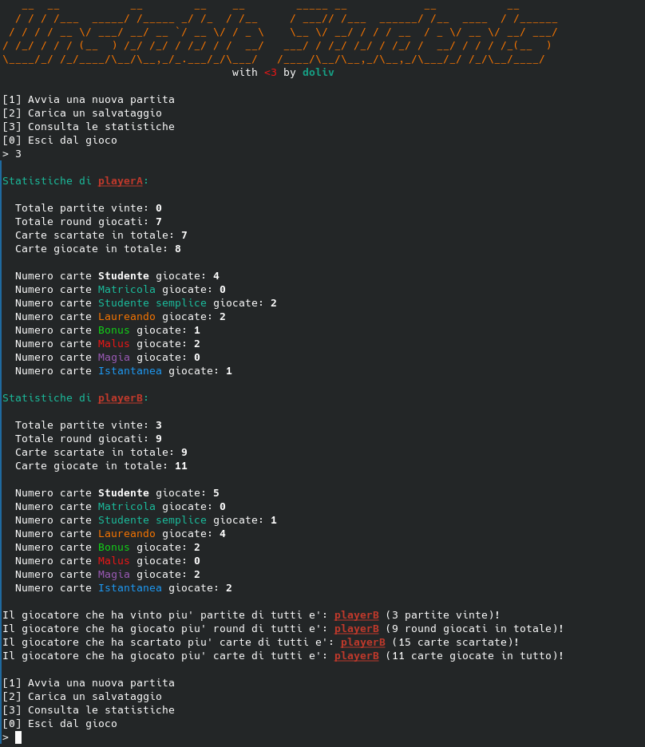

# **UNSTABLE STUDENTS - PR1 2024/25**

>  Questo è un progetto svolto nell'ambito dell'esame di **Programmazione 1 - Modulo II** *(PR1)* del **CdL in Informatica** dell'**Università degli Studi di Cagliari**

| **Studente**          | **Matricola** | **Progetto** | **E-Mail**                        |
|-----------------------|---------------|--------------|-----------------------------------|
| Diego Oliva           | **REDACTED**  |   AVANZATO   | **REDACTED**                      |

> [!IMPORTANT]
> *Progetto **AVANZATO senza modalità automatica/IA**.*

---

<br>


> ### **Table of Content**
>  1. [Compilare ed eseguire il gioco](#compilare--eseguire-il-gioco)
>		- [Linux](#linux)
> 		- [Windows](#windows)
> 		- [Avviare un salvataggio](#avviare-un-salvataggio)
> 		- [Visualizzazione TUI](#visualizzazione-tui)
>  2. [Spiegazione file sorgente](#spiegazione-file-sorgente)
>  3. [Descrizione e scopo strutture aggiuntive](#descrizione-e-scopo-strutture-aggiuntive)
>		- [GameContext](#gamecontext)
>		- [MultiLineText](#multilinetext)
>		- [WrappedText](#wrappedtext)
>		- [PlayerStats](#playerstats)
>  4. [Descrizione flusso di gioco](#descrizione-flusso-di-gioco)
>		- [Menù principale](#menu-principale)
>		- [Game loop](#game-loop)
>		- [Menù d'azione](#menu-dazione)
>		- [Visualizzare le proprie carte](#visualizzare-le-proprie-carte)
>		- [Visualizzare lo stato degli altri giocatori](#visualizzare-lo-stato-degli-altri-giocatori)
>		- [Carte giocabili](#carte-giocabili)
>		- [Giocare una carta](#giocare-una-carta)
>		- [Applicazione degli effetti](#applicazione-degli-effetti)
>		- [Effetti particolari](#effetti-particolari)
>		- [Difendersi da una carta](#difendersi-da-una-carta)
>		- [Conclusione della partita](#conclusione-della-partita)
>		- [File di salvataggio](#file-di-salvataggio)
>		- [Statistiche](#statistiche)

<br>

```
REPOSITORY STRUCTURE
·
│
│ GAME SAVES
├── saves				// directory contenente i salvataggi
│   ├── cache.txt			// cache dei nomi dei salvataggi
│   ├── game.sav
│   └── ···
│
│ SOURCE FILES
├── src					// directory contenente l'intero source code del progetto
│   ├── main.c
│   ├── constants.h
│   ├── structs.h
│   ├── enums.c
│   ├── enums.h
│   ├── types.h
│   ├── card.c
│   ├── card.h
│   ├── game.c
│   ├── game.h
│   ├── effects.c
│   ├── effects.h
│   ├── gameplay.c
│   ├── gameplay.h
│   ├── menu.c
│   ├── menu.h
│   ├── stats.c
│   ├── stats.h
│   ├── saves.c
│   ├── saves.h
│   ├── files.c
│   ├── files.h
│   ├── format.c
│   ├── format.h
│   ├── graphics.c
│   ├── graphics.h
│   ├── logging.c
│   ├── logging.h
│   ├── utils.c
│   ├── utils.h
│   ├── debugging.c
│   └── debugging.h
│
│ BUILD DIRECTORY
├── build				// directory contenente il binario compilato e i file oggetto
│   ├── unstable_students(.exe)		// file eseguibile del gioco
│   └── *.o
│
│ IMAGES
├── imgs				// directory contenente le immagini utilizzate nel README.md
│   ├── banner.png
│   ├── card_box.png
│   ├── cards_group.png
│   ├── defense.png
│   ├── game_demo.mp4
│   ├── game_konsole.png
│   ├── game_xterm.png
│   ├── save_menu.png
│   ├── stats_menu.png
│   ├── view_other_mostra.png
│   ├── view_other.png
│   ├── view_own.png
│   ├── windows_clion.mp4
│   ├── windows_colors_fix.mp4
│   └── windows_terminal.mp4
│
│ OTHER FILES
├── enable_virtualterminal.bat		// script batch per attivazione colori windows
├── log.txt				// file di log del gioco
├── Makefile				// Makefile per la compilazione
├── mazzo.txt				// file contenente l'intero mazzo di gioco (per le nuove partite)
├── provided_savegame.sav		// file di salvataggio fornito
├── riepilogo_savegame.pdf		// descrizione savegame fornito
├── README.md				// relazione e documentazione
├── Specifiche_v2.0.pdf			// specifiche di riferimento per il progetto
├── stats.bin				// file delle statistiche
└── .gitignore				// lista di file da ignorare (per git)
```

<br>
<br>

## Compilare & eseguire il gioco

Per gestire la compilazione ho fatto uso di `make`, creando diversi target nel [Makefile](./Makefile):
- `clean`: elimina il binario compilato e tutti i file oggetto creati durante la compilazione
- `run`: compila e avvia il gioco
- `rebuild`: esegue la pulizia (target `clean`) e compila il gioco
- `gdb`: compila e avvia il gioco tramite il debugger `gdb`, utile per individuare punti e cause di crash
- `valgrind`: compila e avvia il gioco tramite il tool `valgrind` per trovare memory leak e corruzzioni della memoria
- `debug`: compila il gioco con AddressSanitizer, UndefinedBehaviorSanitizer e definendo l'identificatore `DEBUG` per la compilazione condizionale di alcune parti di codice atte a tracciare la gestione della memoria e definire funzioni utili nel debugging

> [!NOTE]
> Il [Makefile](./Makefile) è compatibile sia con [Windows](#windows) che con sistemi [Unix-like](#linux).

---

### Linux
Per compilare il gioco su Linux (nella cartella root del progetto):
```console
make all
```
e per avviare il gioco:
```console
make run
```
---

### Windows
Per compilare su Windows da terminale (nella cartella root del progetto):
```console
mingw32-make all
```
mentre per avviare il gioco:
```console
mingw32-make run
```
come nel seguente video:

https://github.com/user-attachments/assets/966e2348-da3a-4d58-8da4-9147bb8f30ac


#### Fix dei colori su Windows
> [!IMPORTANT]
> Da come si può vedere nel video, sul **Command Prompt** di Windows (ma anche sul terminale integrato di CLion e avviando direttamente l'eseguibile) i colori potrebbero non essere visualizzati correttamente.
> Il problema si può risolvere aggiungendo una chiave **DWORD** chiamata `VirtualTerminalLevel` con valore `1` al registro di sistema nel percorso `HKEY_CURRENT_USER/Console/`, tramite **regedit** o con il seguente comando:
> ```batch
> reg add HKCU\Console /v VirtualTerminalLevel /t REG_DWORD /d 1 /f
> ```
> oppure utilizzando [lo script batch](./enable_virtualterminal.bat) incluso nella repository, come dimostrato nel seguente video:
> 
> https://github.com/user-attachments/assets/06f2266d-6444-4c30-89ac-6ff1462875fa

Per compilare e avviare il gioco da **CLion** seguire le istruzioni mostrate nel seguente video (il fix dei colori si applica ugualmente):

https://github.com/user-attachments/assets/a019ed9f-e39a-4eaa-a2d2-647ecb13fb9a

---

### Avviare un salvataggio
Per avviare il gioco caricando direttamente un salvataggio ci si deve recare nella root del progetto e avviare il gioco (usando il suo percorso relativo) fornendo come argomento al programma il nome del file di salvataggio (senza includere l'estensione `.sav`) inserito nella cartella dei salvataggi `saves/`, come segue:
```console
./build/unstable_students <nome salvataggio>
```
o il corrispettivo su **Windows**:
```console
.\build\unstable_students.exe <nome salvataggio>
```
Il salvataggio caricato verrà salvato nella [cache dei salvataggi](#file-di-salvataggio) per futuri caricamenti veloci.

---

### Visualizzazione TUI
> [!WARNING]
> Per avere una corretta visualizzazione della **TUI** (Terminal User Interface) del gioco è necessario eseguirlo su un terminale con almeno **146** colonne, diversamente i gruppi di carte più grandi non verrebbero rappresentati correttamente dato che andrebbero a capo rompendo la formattazione.

> [!NOTE]
> *Per usare il gioco su terminali più "piccoli" (con meno colonne) è sufficiente diminuire la costante `CARDS_PER_ROW` (attualmente impostata a `4`) nel [file delle costanti](src/constants.h).*

Ho volontariamente evitato di utilizzare caratteri **non ASCII**, anche se avrebbero potuto rendere l'interfaccia più carina, al fine di evitare problemi di compatibilità.

Ecco due esempi di come dovrebbe essere visualizzata l'interfaccia del gioco in maniera corretta (su terminali da almeno **146** colonne):

|  |
|:--:|
| *TUI del gioco su terminale Konsole* |

|  |
|:--:|
| *TUI del gioco su terminale XTerm* |

Ed ecco una registrazione di una partita intera (della quale sono presenti [log](./log.txt) e [statistiche](./stats.bin)):

https://github.com/user-attachments/assets/1954c799-50fa-4c62-a9fd-90db8c5c0a70


## Spiegazione file sorgente
Per ciascun file sorgente che contiene definizioni di funzioni utilizzate anche da altre unità di compilazione esiste un file header corrispondente, contenente i prototipi di tali funzioni "esportate", ma, tendenzialmente, non di quelle utilizzate solo internamente al file sorgente, per evitare l'uso di funzioni interne "dall'esterno": uso gli header come interfacce alle rispettive unità di compilazione, che sono divise per "temi" di gestione, come descritto in seguito.\
Non ho associato un corrispettivo file sorgente a tutti i file header (ad esempio [constants.h](./src/constants.h), [types.h](./src/types.h) e [structs.h](./src/structs.h)) poiché in alcuni casi è solo necessario definire dei nuovi tipi, delle strutture o delle costanti (tramite macro) utilizzate in diverse parti del progetto.

Di seguito sono descritti brevemente i diversi file sorgente e il loro rispettivo scopo:

### main.c
Questo file sorgente contiene l'entry point del programma, ovvero la funzione `main`, nella quale avviene l'inizializzazione (e cleanup) del gioco, viene mostrato il menù principale e viene avviato il [game loop](#game-loop).

### constants.h
Questo header non ha un corrispettivo file sorgente .c associato in quanto contiene solamente le definizioni delle costanti (es. numero massimo e minimo di giocatori e lunghezze massime di alcune stringhe) e alcuni letterali usati nel gioco (es. nomi statici dei file coi quali interagisce il programma e stringhe utilizzate nella realizzazione della grafica su terminale).

### structs.h
In questo header sono definite tutte le strutture utilizzate nel progetto (comprese quelle [aggiuntive](#descrizione-e-scopo-strutture-aggiuntive)). Ho scelto di inserirle tutte nello stesso file header anzi che in appositi file come card.h, player.h e simili perché ho trovato questa soluzione meno confusionaria e dispersiva.

### enums.c & enums.h
Seguendo la stessa logica della della scelta adottata per structs.h, nel file header sono definite tutte le enumerazioni usate nel progetto.
Nel file .c sono invece definite le funzioni per effettuare le conversioni da ogni valore di ciascun enum alle corrispondenti stringhe.

### types.h
In questo file sono contenute le definizioni dei tipi user-defined usati nel progetto.

### card.c & card.h
In questi file sorgente sono definite le principali operazioni effettuabili sulle carte, allo stesso modo di funzioni ausiliare nella gestione delle stesse.

### game.c & game.h
Questi file sorgente contengono delle funzioni essenziali per l'inizializzazione e la terminazione del gioco, ma non utilizzate durante il suo dinamico svolgimento.

### effects.c & effects.h
Questi file sorgente contengono l'implementazione di tutti gli [effetti](#applicazione-degli-effetti).

### gameplay.c & gameplay.h
Questi file sorgente contengono praticamente l'intera logica di gioco, le principali funzioni per la gestione della partita in corso ed il [sistema di difesa](#difendersi-da-una-carta).

### menu.c & menu.h
Contengono solamente la funzione che gestisce il menù principale mostrato all'avvio del gioco, prima di iniziare o riprendere una partita.

### stats.c & stats.h
In questi file viene gestito il caricamento, salvataggio e aggiornamento delle [statistiche](#statistiche).

### saves.c & saves.h
Qui viene gestita la logica dei salvataggi, con relativo menù di scelta [salvataggio salvato nella cache](#file-di-salvataggio).

### files.c & files.h
In questi file sorgente sono contenute le principali interazioni, con aperture, letture, scritture e chiusure dei file di testo e binari coi quali il gioco interagisce.

### format.c & format.h
Formattazione stringhe e [testo multilinee](#multilinetext).

### graphics.c & graphics.h
Gestione della grafica dinamica per pretty-printing delle carte in gruppi e banner di inizio round.

### logging.c & logging.h
Controllo e gestione del file di log.

### utils.c & utils.h
Questi file sorgente contengono diverse utilities utilizzate nell'intero progetto per agevolare la scrittura di codice, inclusi alcuni wrapper di funzioni per la gestione della memoria.

### debugging.c & debugging.h
Questi file sorgente non sono davvero essenziali per il funzionamento del gioco e sono stati utilizzati solo durante lo sviluppo per individuare e correggere bug, infatti sono esclusi dalla compilazione se non è definito l'identificatore `DEBUG` (vedasi [compilazione](#compilare--eseguire-il-gioco)).

<br>

## Descrizione e scopo strutture aggiuntive
### GameContext
La struttura aggiuntiva principale che mi è stata molto utile nel mantenere gestibile il passaggio di parametri fra le varie funzioni è stata GameContext, infatti essa viene passata a quasi tutte le funzioni inerenti alla gestione della partita.
Ecco la struttura in questione:
```c
struct GameContext {
	giocatoreT *curr_player;
	cartaT *mazzo_pesca, *mazzo_scarti, *aula_studio;
	int n_players, round_num;
	bool game_running;
	FILE *log_file;
	const char *save_path;
	player_statsT *curr_stats;
};
typedef struct GameContext game_contextT;
```

Mi è sufficiente utilizzare tale struttura per contenere l'intero stato della partita, come si può notare dai prototipi delle funzioni usate per caricare e salvare i salvataggi:

```c
game_contextT *load_game(const char *save_name);
void save_game(game_contextT *game_ctx);
```

Ciò che contiene questa struttura è:
- un puntatore al giocatore che deve giocare (o che sta giocando) questo turno, che viene fatto avanzare con comodità grazie alla circolarità della lista dei giocatori alla quale appartiene.
- un puntatore alla testa ciascuna lista concatenata di carte: pesca, scarti e aula studio.
- un intero rappresentante la quantità di giocatori che stanno partecipando alla partita.
- un intero rappresentante il numero del round al quale lo stato della partita si trova.
- un booleano rappresentante se il gioco è in esecuzione (o in conclusione, solo quando un giocatore vince e la partita termina, oppure si esce dalla partita con il tasto **0** del [menù d'azione](#menu-dazione)).
- un puntatore a FILE (file stream) relativo al file di log, aperto prima di iniziare a giocare e chiuso quando si esce dal gioco.
- un puntatore a una stringa allocata sullo heap contenente il percorso relativo del [file di salvataggio](#file-di-salvataggio) dell'attuale partita.
- un puntatore alle [statistiche](#statistiche) riferite al giocatore corrente, che viene fatto avanzare parallelamente a quest'ultimo.

L'utilizzo che faccio di questa struttura è semplice e lineare: la alloco sullo heap all'avvio del gioco (tramite le funzioni `new_game` o `load_game`) e ne passo il puntatore alle diverse funzioni del [game-loop](#game-loop) (`begin_round`, `play_round`, `end_round`) che lo passeranno a loro volta ad altre funzioni che implementano la logica di gioco; alla fine dell'esecuzione del gioco (uscita dal game-loop) la rilascio assieme a tutti i suoi campi (tramite `clear_game`).

---

### MultiLineText
Per gestire la formattazione di testo su più linee ho definito una apposita struttura che possa contenere un numero arbitrario di linee, tramite allocazioni dinamiche.
Ecco la struttura:
```c
struct MultiLineText {
	int n_lines;
	const char **lines;
	int *lengths;
};
typedef struct MultiLineText multiline_textT;
typedef multiline_textT freeable_multiline_textT;
```

Il campo `lines` contiene un puntatore ad un array di `char*` (dinamicamente allocato) contenente esattamente `n_lines` puntatori. \
Il campo `lengths` contiene un puntatore ad un array di interi (dinamicamente allocato) contenente esattamente `n_lines` interi, rappresentante ciascuno la lunghezza dell'**i**-esima linea puntata dall'array `lines` all'indice `i`.

Si può notare che questa struttura viene associata a due diversi tipi (definiti in [types.h](src/types.h)), il secondo dei quali (`freeable_multiline_textT`) delinea, tramite il suo nome, la necessità di effettuare un cleanup delle linee (stringhe) in esso contenute, poiché tutte allocate nell'heap; la funzione per fare ciò è `clear_freeable_multiline`.

I principali file nei quali viene impiegata questa struttura sono [format.c](src/format.c) e [graphics.c](src/graphics.c). \
Questa struttura mi è stata largamente d'aiuto per rappresentare i box delle carte formattate singolarmente (tramite `build_card`), per poi printarli tutti assieme lungo una riga ed eventualmente in colonne, come matrici tramite la funzione `show_cards_restricted`, ottenendo risultati come il seguente:

|  |
|:--:|
| *Gruppo di box di carte stampate su diverse linee e colonne* |

---

### WrappedText
Nuovamente, per la gestione della formattazione, ho creato una apposita struttura per contenere una stringa di testo che viene divisa in più linee, rispettando una data lunghezza massima, tramite la sostituzione, nelle corrette posizioni, degli spazi con dei terminatori di stringa (`'\0'`), di fatto, creando nuove sottostringhe. La logica di tale divisione è gestita in [format.c](src/format.c) dalla funzione `wrap_text`. \
Ecco la struttura dati che contiene le informazioni necessarie a mantenere traccia delle sottostringhe generate:
```c
struct WrappedText {
	char *text;
	multiline_textT multiline;
};
typedef struct WrappedText wrapped_textT;
```

Come si può vedere questa struttura fa uso della precedentemente descritta struttura [MultiLineText](#multilinetext) nella sua forma che non necessita cleanup di ciascuna delle stringhe singolarmente, dato che la funzione `wrap_text` usa solamente una stringa allocata sullo heap (puntata da `text` per poi essere freeata) che viene splittata, ma pur sempre mantenuta in un solo chunk dell'heap (che contiene quindi tutte le sottostringhe).

Ho usato questa struttura per formattare all'interno del box delle carte le descrizioni andando a capo in maniera dinamica, come nell'esempio di seguito, partendo dalla stringa
di descrizione `"Se questa carta e' nella tua aula all'inizio del tuo turno, puoi scartare 2 carte poi eliminare una carta studente dall'aula di un altro giocatore."` si ottiene questo risultato wrappandola:

|  |
|:--:|
| *Box della carta 'Aula dei vecchi progetti'* |


### PlayerStats
Questa è la struttura che permette di rappresentare le [statistiche di un giocatore](#statistiche) ed include i seguenti campi:
```c
struct PlayerStats {
	char name[GIOCATORE_NAME_LEN+1];
	int wins, rounds, discarded;
	int played_cards[CARDS_TYPE_COUNT];
	player_statsT *next;
};
typedef struct PlayerStats player_statsT;
```

Questa struttura contiene:
- nome del giocatore al quale si riferiscono le statistiche.
- numero di vittorie del giocatore.
- numero di round giocati dal giocatore.
- numero di carte scartate dal giocatore.
- numero di carte giocate dal giocatore per ciascun tipo di carta.
- puntatore ad una struttura del medesimo tipo riferita alle statistiche del giocatore seguente (next).

Tutta la logica e l'utilizzo di questa struttura è descritta nella [sezione delle statistiche](#statistiche) ed è gestita in [stats.c](src/stats.c).


<br>

## Descrizione flusso di gioco
> [!TIP]
> Descrivere ad alto livello come vengono gestite le varie fasi di gioco (es. il loop principale, la gestione degli eventi, ecc.)

In questa sezione del `README.md` e nel codice (variabili e commenti) faccio riferimento a:
- utente [user]: chi interagisce col gioco sul terminale.
- giocatore corrente [curr(ent) player]: il giocatore a cui spetta giocare nell'attuale round.
- giocatore target: il giocatore che dovrà subire degli effetti (può essere il giocatore corrente).
- carte giocabili: le carte che è permesso giocare al giocatore corrente.
- carte duplicate: delle copie identiche di una stessa carta.
- lunghezza visibile [visible length]: la lunghezza visiva di una stringa una volta stampata sul terminale, non considerando gli escape ANSI per i colori e la formattazione (quindi non si tratta sempre della sua lunghezza in bytes in memoria).

---

### Menu' principale
Da questo menù è possibile:
- Avviare una nuova partita: caricando quindi le carte del mazzo e creando i nuovi giocatori per poi avviare il [game-loop](#game-loop).
- Caricare un [salvataggio](#file-di-salvataggio) dalla cartella dei salvataggi avviando così il [game-loop](#game-loop).
- Visualizzare le [statistiche](#statistiche).
- Uscire dal gioco.

---

### Game loop
Ho suddiviso il flusso del game loop (ciascun round) in 3 fasi:
- **begin** (`begin_round`): [salva la partita](#file-di-salvataggio), mostra le informazioni relative al round attuale, [applica gli effetti](#applicazione-degli-effetti) iniziali delle carte dell'aula e fa pescare una carta (dovuta da regolamento) al giocatore corrente.
- **play** (`play_round`): mostra il [menù di azione](#menu-dazione) al giocatore corrente.
- **end** (`end_round`): vengono scartate le eventuali carte in eccesso dalla mano del giocatore corrente, vengono aggiornate le statistiche e viene effettuato il controllo per la sua vittoria, con conseguente [fine](#conclusione-della-partita) o continuazione della partita.

Al termine del game loop (causato solamente dall'uscita volontaria dalla partita o dalla vittoria di un giocatore) avviene il salvataggio su file delle statistiche raccolte durante la partita e viene poi effetuato il [cleanup dello stato della partita](#gamecontext).

---

### Menu' d'azione
Nel menù di scelta d'azione è possibile scegliere fra le seguenti opzioni:

- `Gioca una carta dalla tua mano`: permette al giocatore corrente di [giocare una carta qualsiasi dal suo mazzo](#giocare-una-carta). Termina la fase d'azione se viene giocata una carta.
- `Pesca un'altra carta`: fa pescare una carta al giocatore corrente. Termina la fase d'azione.
- `Visualizza le tue carte`: [mostra al giocatore corrente tutte le sue carte](#visualizzare-le-proprie-carte): mazzo, aula studenti, bonus/malus.
- `Visualizza lo stato degli altri giocatori`: permette al giocatore corrente di [visualizzare lo stato degli altri giocatori](#visualizzare-lo-stato-degli-altri-giocatori), tenendo conto dell'[effetto particolare](#effetti-particolari) `MOSTRA`.
- `Esci dalla partita`: chiede conferma ed [esce dal gioco](#conclusione-della-partita).

---

### Visualizzare le proprie carte
Visualizzando le proprie carte, tramite il [menù d'azione](#menu-dazione), vengono mostrate tutte le carte in possesso del giocatore attuale:
- Aula studenti
- Bonus/Malus
- Mano

Ed ecco come risulta in gioco:

|  |
|:--:|
| *Visualizzazione delle proprie carte* |

---

### Visualizzare lo stato degli altri giocatori
Dal [menù d'azione](#menu-dazione) è possibile visualizzare lo stato degli altri giocatori, scegliendo se visualizzarlo di tutti in serie o di un altro specifico giocatore a scelta.

Se un giocatore del quale si visualizza lo stato ha nei suoi Bonus/Malus una carta con l'[effetto particolare](#effetti-particolari) `MOSTRA`, vengono mostrate tutte le carte della sua mano *in chiaro* anzi che mostrarne solo il numero.

|  |
|:--:|
| *Visualizzazione dello stato di un altro giocatore senza MOSTRA* |

|  |
|:--:|
| *Visualizzazione dello stato di un altro giocatore con effetto MOSTRA* |

---

### Carte giocabili
Le carte giocabili vengono contate tramite la funzione `count_playable_cards`, che considera vari casi, di seguito spiegati:
- Solo carte del tipo specificato (type) possono essere giocate: supponendo di star giocando a seguito di un effetto come `[GIOCA, IO, STUDENTE]` sarebbe possibile giocare solamente una carta `STUDENTE` (quindi `MATRICOLA`, `STUDENTE_SEMPLICE` o `LAUREANDO`) dal proprio mazzo, mentre con type = `ALL` questo controllo viene sempre passato.
- Le carte di tipo `ISTANTANEA` non possono essere giocate durante il proprio turno.
- Le carte con tipo target di un [effetto particolare](#effetti-particolari) `IMPEDIRE` attivo sul giocatore non possono essere giocate.

---

### Giocare una carta
La funzione `play_card`, che si occupa per l'appunto di permettere al giocatore corrente di scegliere una carta del suo mazzo da giocare.\
Se non ci sono carte giocabili secondo quanto descritto in [Carte Giocabili](#carte-giocabili) la fase di giocata di una carta termina senza chiedere alcuna interazione all'utente in quanto non è possibile giocare alcuna carta.\
Successivamente, una volta accertato che il giocatore abbia delle carte che può giocare nel sul mazzo, gli viene richiesto (in base al tipo della carta da giocare), quale sceglie fra le carte del suo mazzo.\
Se per la carta scelta vi è un effetto `IMPEDIRE` attivo sul giocatore corrente, tale carta non potrà essere giocata e verrà chiesto al giocatore di sceglierne un'altra.

In base al tipo di carta si svolgeranno azioni diverse:
- **Bonus**/**Malus**: si chiede al giocatore corrente su quale giocatore target vuole applicare la carta (lo stesso è compreso fra le scelte possibili) e tale giocatore (se non è lo stesso giocatore che tira la carta) avrà la possibilità di [difendersi](#difendersi-da-una-carta) dal piazzamento della carta Bonus/Malus (se nel suo mazzo ha a disposizione carte con l'effetto `IMPEDIRE` che glielo permettano)
- **Studente**: l'unico possibile target di tali carte è il giocatore corrente stesso
- **Magia**: il target della carta è definito dagli effetti descritti nella carta stessa

In caso di *carta duplicata* già presente nell'aula del target viene chiesta conferma di voler giocare comunque tale carta sul target all'utente e in caso positivo la carta andrà persa (scartata) e l'azione di play si conclude, mentre in caso negativo l'utente potrà scegliere una nuova carta o un nuovo target su cui giocarla (l'azione di play non si considera conclusa).

Giocando una carta `BONUS`/`MALUS` o `STUDENTE`, se il target non si è difeso, verrà inserita nella sua aula la carta giocata, [attivando eventuali effetti](#applicazione-degli-effetti) di ingresso nell'aula (`SUBITO`).

Al giocare di una carta `MAGIA`, questa verrà prima rimossa dalla mano del giocatore corrente, poi ne verranno applicati gli effetti, e successivamente verrà spostata nel mazzo degli scarti. Questo per evitare particolari edge case (si immagini giocare una carta `MAGIA` che impone di eliminare una carta dal proprio mazzo e si scegliesse la carta stessa: senza l'aggiunta di altri check ne conseguirebbe un doppio inserimento nel mazzo degli scarti).

---

### Applicazione degli effetti

Per l'applicazione degli effetti ho adottato un flow di selezione dell'operazione da effettuare col seguente ordine:
* `apply_effects` chiama `apply_effects_now` se il `quando` fornito corrisponde.
* `apply_effects_now` verifica se gli effetti della carta che si vogliono applicare sono opzionali, e in tal caso chiede all'utente se vuole applicarli o meno. In caso positivo si procede a chiamare `apply_effect` per ciascun effetto appartenente alla carta, verificando se l'effetto è stato bloccato dalla difesa della vittima. Se gli effetti vengono bloccati da una difesa, le carte `BONUS` e `MALUS` finiscono dritte negli scarti.
* `apply_effect` chiama la funzione `apply_effect_target` per ciascun giocatore target dell'effetto, dopo aver chiesto a tutti gli interessati (eccetto il giocatore corrente) che possono, se vogliono difendersi dall'effetto.
* `apply_effect_target` semplicemente chiama l'apposita funzione `apply_effect_<nome azione>_target` sul target fornito.

#### Ecco una breve descrizione delle azioni degli effetti applicabili:

- `ELIMINA`: il giocatore corrente sceglie quale carta vuole eliminare dall'aula del target. La carta che viene eliminata dall'aula del target attiva i suoi effetti di uscita dall'aula se con quando = `FINE`.
- `SCARTA`: se il target è il giocatore corrente, può scegliere quale carta scartare dal suo mazzo, diversamente la carta viene estratta casualmente dal mazzo della vittima e scartata.
- `GIOCA`: se il target è il giocatore corrente, esso gioca una carta dal suo mazzo, diversamente si crea un sotto-round all'interno del round nel quale il giocatore target dell'effetto gioca una carta del tipo specificato come se fosse il suo turno.
- `RUBA`: effetto sensato solo con target diverso dal giocatore corrente. La carta che viene rubata viene spostata dall'aula del target all'aula del giocatore corrente, attivando eventuali effetti di uscita o entrata in aula.
- `PRENDI`: effetto sensato solo con target diverso dal giocatore corrente. La carta che viene rubata viene spostata dalla mano del target alla mano del giocatore corrente.
- `PESCA`: il giocatore target pesca una carta dal mazzo di pesca. Se il tipo di carta target dell'effetto è diverso da `ALL`, avviene prima la pesca di una carta come usuale ma successivamente, se la carta pescata non è del tipo specificato, questa viene automaticamente scartata e la pesca si conclude.
- `SCAMBIA`: il mazzo (mano) del giocatore target viene scambiato con quello del giocatore corrente. L'unico target carte sensato è `ALL`.

---

### Effetti particolari

Non tutti gli effetti rispettano il pattern di essere "applicabili" da un giocatore giocante ad un giocatore target al giocare della carta come quelli descritti in [applicazione degli effetti](#ecco-una-breve-descrizione-delle-azioni-degli-effetti-applicabili).

Vi sono effetti che sono `SEMPRE` in essere una volta che la carta viene piazzata (attivi finché la carta non viene rimossa):

- `MOSTRA`: quando una carta con questo effetto è nei Bonus/Malus di un giocatore, alla visualizzazione del suo stato da parte degli altri giocatori, oltre alle normali carte dell'aula (pubbliche), verranno mostrare anche le carte del suo mazzo (private).
- `IMPEDIRE`: quando una carta con questo effetto è nei Bonus/Malus di un giocatore, non gli sarà possibile giocare carte del tipo specificato dall'effetto `IMPEDIRE`.
- `INGEGNERE`: quando una carta con questo effetto è nei Bonus/Malus di un giocatore, non gli sarà possibile vincere la partita anche se dovesse raggiungere il numero di studenti per vincere la partita nella sua aula.

Esiste inoltre un'altra azione degli effetti che si comporta ancora diversamente ed è alla base del sistema di difesa come descritto nella sezione relativa al [difendersi da una carta](#difendersi-da-una-carta): `BLOCCA`. Questa azione può essere presente solo in carte del tipo `ISTANTANEA` e permette di "rispondere" all'effetto di una carta del tipo specificato che si dovrebbe subire, bloccandolo.

---

### Difendersi da una carta
Quando devono essere applicati (da parte del giocatore corrente) degli effetti che impattano gli altri giocatori (`TU`, `VOI`, `TUTTI`), questi ultimi hanno la possibilità di difendersi "rispondendo" alla giocata (ad un effetto che li colpirebbe) usando una carta di tipo `ISTANTANEA`. Ovviamente tale carta deve poter essere giocata dalla vittima (non ci devono essere effetti `IMPEDIRE` attivi sulle carte `ISTANTANEA` del giocatore vittima).\
Ho assunto che tutte le carte `ISTANTANEA` debbano avere **anche** l'effetto `BLOCCA` (con carta target compatibile con quella dalla quale ci si vuole difendere) per potersi difendere al fine di semplificare l'implementazione della "risposta" ad effetti imposti da altri giocatori, ma ho reso comunque possibile aggiungere altri effetti oltre al `BLOCCA` alle carte di difesa.\
Una volta selezionata la carta con la quale la vittima si vuole difendere (se si vuole difendere), è come se si creasse un __sottoround all'interno del round__ dato che vengono eseguiti gli effetti della carta scelta (es. `[GIOCA, IO, BONUS]` o `[RUBA, TU, LAUREANDO]`) come se fosse il turno della vittima. Una volta portati a termine gli effetti della carta `ISTANTANEA` usata per difendersi, questa viene scartata e l'iniziale effetto della carta attaccante viene fermato, assieme all'intera catena di effetti della carta attaccante stessa.\
Ad ogni effetto di una carta attaccante verrà chiesto nuovamente ai giocatori target che possono difendersi se vogliono farlo (in caso avessero rifiutato di farlo per gli effetti precedenti e cambiato idea sugli effetti successivi) fin quando qualcuno non si difenda o finiscano gli effetti della carta attaccante.\
La logica del sistema di difesa è gestita dalla funzione `target_defends` (che utilizza in aggiunta `player_can_defend` e `card_can_block`).

Nell'applicare gli effetti con target giocatori `VOI` o `TUTTI`, prima di iniziare ad applicare l'effetto, viene domandato a ciascun giocatore vittima (eccetto colui che gioca la carta attaccante) che ne ha la possibilità se vuole bloccare l'attacco prima che questo inizi e difendere, di fatto, tutte le vittime.

Difendendosi dalla carta attaccante questa farà una diversa fine in base al suo tipo:
- `LAUREANDO`: la carta resterà all'interno dell'aula del giocatore attaccante, ma gli effetti saranno fermati
- `MAGIA`: la carta finirà (come normalmente) negli scarti e gli effetti saranno fermati
- `BONUS`/`MALUS`: la carta finirà negli scarti

Ecco come viene visualizzato un esempio di difesa sulla **TUI**:

|  |
|:--:|
| *Esempio di difesa* |

---

### Conclusione della partita

Ad ogni fine round viene controllata la **win condition**, ovvero se il giocatore del round attuale:
- ha almeno **6** carte `STUDENTE` presenti nell'aula.
- non ha alcuna carta con effetto `INGEGNERE` nei bonus/malus.

Se entrambe le precedenti condizioni sono verificate, il giocatore corrente ha vinto la partita, portandola al termine (arresto del [game-loop](#game-loop)).\
Il [salvataggio](#file-di-salvataggio) della partita attuale non verrà aggiornato ma resterà fermo all'inizio del round attuale (quando è avvenuto il salvataggio).\
Le [statistiche](#statistiche) vengono aggiornate e salvate su file.

Le stesse conseguenze le si hanno uscendo dalla partita durante un round tramite l'opzione di uscita del [menù d'azione](#menu-dazione).

---

### File di salvataggio

Nei file di salvataggio, oltre a tutti i campi presenti nel formato descritto dalle [specifiche](./Specifiche_v2.0.pdf) ho aggiunto un campo opzionale rappresentante il numero del round attuale alla fine del file. In caso tale campo non fosse trovato (nel caso di caricamento di file di salvataggio con formato diverso dal mio) il round attuale viene impostato a 1.

Per la gestione dei salvataggi presenti ho inserito una cache, gestita tramite un file di testo nella cartella dei salvataggi, permettendo agli utenti di caricare velocemente un salvataggio già caricato in precedenza, tramite il seguente menù:

|  |
|:--:|
| *Menù di caricamento salvataggio* |

Caricando un file di salvataggio mai caricato in precedenza (selezionando 'no' nel precedente menù e inserendo il nome del salvataggio inserito nella cartella dei salvataggi), questo verrà aggiunto alla cache e al seguente avvio verrà mostrato fra i salvataggi caricabili velocemente tramite numero dalla lista. Anche avviando una nuova partita, il nome scelto per il salvataggio verrà aggiunto alla cache per futuri avvii veloci.

---

### Statistiche

I dati raccolti per ogni giocatore sono:
- numero vittorie
- numero round giocati
- numero carte scartate in totale
- numero carte giocate in totale
- numero carte giocate per ogni tipo di carta

Le statistiche sono controllate da [stats.c](src/stats.c) e aggiornate tramite delle chiamate alle seguenti funzioni:
- `stats_add_win`
- `stats_add_round`
- `stats_add_discarded`
- `stats_add_played_card`

Il file binario delle statistiche contiene le statistiche di tutti i giocatori che hanno giocato al gioco (in tutte le partite giocate).\
Ciascuna entry (blocco) nel formato di tale file rappresenta una struttura `PlayerStats`, che è riferita puramente ad un giocatore, distinto dal suo nome.
Le statistiche raccolte vengono aggiornate su file ad ogni fine round tramite la funzione `save_stats`.

La struttura GameContext contiene un puntatore a una struttura `PlayerStats` (testa di una linked list circolare) che viene aggiornato sincronamente al campo `curr_player`.

Con i dati raccolti è possibile comparare i diversi giocatori e oltre a mostrarne le pure statistiche si può effettuare il calcolo del massimo per ciascun parametro raccolto.

Ecco il menù per consultare le statistiche aggregate di tutti i giocatori, raggiungibile tramite il tasto **3** del menù principale:

|  |
|:--:|
| *Menù delle statistiche* |
